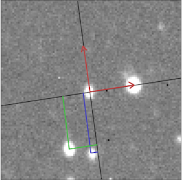
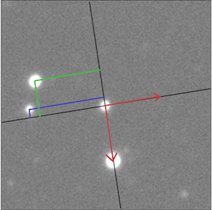

# Match Stars
find matching stars in rotated and scaled images

**1.12.2022**  
**Dominika Świtlik** 

### Reguirements:
python3, numpy, pickle, os, unittest 

### Run:

### Program description

#### Basic test

#### Libraries:

Python3    
NumPy  

